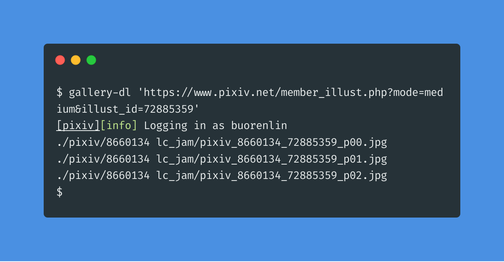

# Unofficial Snap Packaging for gallery-dl
<!--
	Use the Staticaly service for easy access to in-repo pictures:
	https://www.staticaly.com/
-->
 Icon of gallery-dl")

**This is the unofficial snap for gallery-dl**, *"A command-line program to download image-galleries and -collections from several image hosting sites"*. It works on Ubuntu, Fedora, Debian, and other major Linux distributions.

Published for  with 💠by Snapcrafters

## Installation
([Don't have snapd installed?](https://snapcraft.io/docs/core/install))

### In a Terminal
    # Install the snap #
    sudo snap install gallery-dl
    
    # Connect the snap to optional security confinement interfaces #
    ## For downloading the files to `/media` and `/mnt` ##
    sudo snap connect gallery-dl:removable-media
    
    # Launch the application #
    gallery-dl
    snap run gallery-dl # If you have another existing gallery-dl installation

### The Graphical Way

## What is Working
* Download ImageBam gallery
* Download Pixiv gallery
* Download Pixiv clip
* Convert Pixiv Ugoira to WebM
* OAuth authentication with Flickr
* Download private Flickr photo
* Download Tumblr public album

### Test Cases
* [【バンドリ】「💙バレンタイン💖」/「たや」的插畫 [pixiv]](https://www.pixiv.net/member_illust.php?mode=medium&illust_id=73280679) (Pixiv gallery)
* [【ドット絵】「うーん...やみー!!」/「鬼雷 昇炎」的動圖 [pixiv]](https://www.pixiv.net/member_illust.php?mode=medium&illust_id=73280348) (Pixiv clip(Ugoira format))
* [Tumblr 台灣團隊 — i-explore-taiwan: 基隆::正豐鵝肉 看起來非常多汁。🤤🤤🤤](https://taiwanteam.tumblr.com/post/182890602601/i-explore-taiwan-%E5%9F%BA%E9%9A%86%E6%AD%A3%E8%B1%90%E9%B5%9D%E8%82%89-%E7%9C%8B%E8%B5%B7%E4%BE%86%E9%9D%9E%E5%B8%B8%E5%A4%9A%E6%B1%81) (Tumblr gallery)

## What is NOT Working...yet 
Check out the [issue tracker](https://github.com/Lin-Buo-Ren/gallery-dl-snap/issues) for known issues.

## Support
* Report issues regarding using this snap to the issue tracker:  
  <https://github.com/Lin-Buo-Ren/gallery-dl-snap/issues>
* You may also post on the Snapcraft Forum, under the `snap` topic category:  
  <https://forum.snapcraft.io/c/snap>
